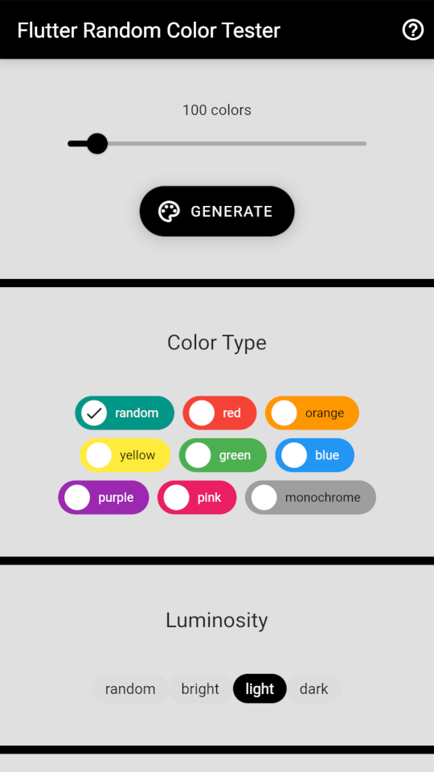
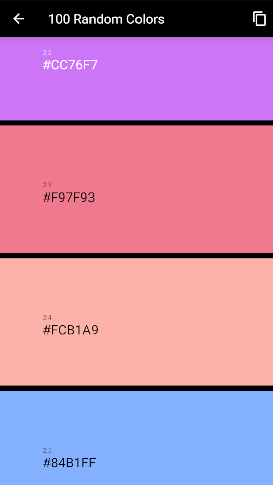
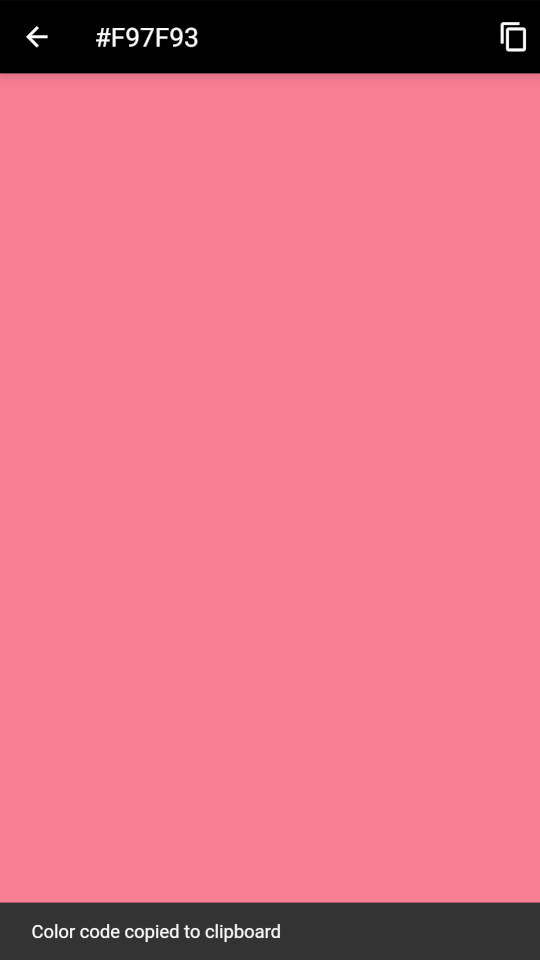

# Flutter Random Color Tester

[](https://flutter.dev/)
[](https://frctester.techaurelian.com)
[](https://github.com/TechAurelian/flutter_random_color_tester/actions/workflows/build-flutter-web.yml)
[](https://github.com/TechAurelian/flutter_random_color_tester)
[](https://github.com/TechAurelian/flutter_random_color_tester/commits/main)
[](https://github.com/TechAurelian/flutter_random_color_tester/blob/main/LICENSE)

A basic Flutter project that tests the [flutter_randomcolor](https://pub.dev/packages/flutter_randomcolor) Dart package for generating attractive random colors.

flutter_randomcolor is a Dart port of David Merfield's [randomColor](https://github.com/davidmerfield/randomColor) JavaScript utility.

Flutter Random Color Tester is actually a Flutter web app that you can run in your browser to generate dozens or hundreds of attractive random colors. You can select options to influence the type of color it produces and copy the generated colors to the clipboard for reuse in other apps or places.

Just open https://frctester.techaurelian.com in your browser to give it a try.

## Screenshots

<p>
  
  
  
</p>

## Getting Started

1. If you don't have the Flutter SDK installed, please visit the official [Flutter](https://docs.flutter.dev/get-started/install) website.

2. Fetch the latest source code from the master branch.

``` 
git clone https://github.com/TechAurelian/flutter_random_color_tester.git
```

3. Run the app with Visual Studio Code or Android Studio. Or the command line.

``` 
flutter pub get
flutter run
```

## Built With

- [Flutter](https://flutter.dev/) - Build apps for any screen.
- [Visual Studio Code](https://code.visualstudio.com/) - Code editing. Redefined.
- [flutter_randomcolor](https://pub.dev/packages/flutter_randomcolor) - A dart package for generating attractive random colors.
- [url_launcher](https://pub.dev/packages/url_launcher) - A Flutter plugin for launching a URL.

## Contribute

If you have an issue or found a bug, please raise a GitHub issue [here](https://github.com/TechAurelian/flutter_random_color_tester/issues). Pull requests are also welcome.

## License

Flutter Random Color Tester is licensed under the [MIT license](LICENSE).
